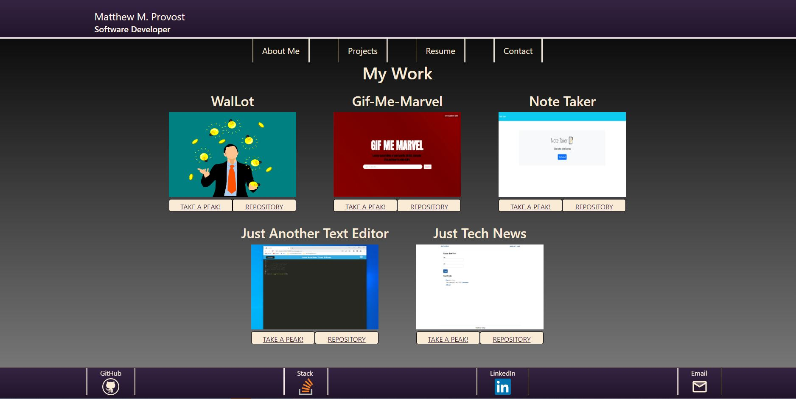

# React Portfolio

Portfolio Live Link: https://provostma21.github.io/portfolio/

## Table of Contents

-[Description](#description) -[Installation](#installation) -[Usage](#usage) -[Contribute](#contribute) -[Tests](#tests) -[Creator](#creator)

## Description

This project uses React to give the user some basic information on myself as a developer as well as some projects I have completed. It also gives the user the resources to contact me, whether it is to ask questions, give advice, or present opportunities.

## Installation

There should not be anything to install except if the user is interested in downloading my resume which is found on the Resume page by clicking the Download button.

## Usage

The user can click any of the links on the navigation bar in order to change from page to page.

On the Projects page, you can click 'Take a peak' to see a live demo of the project affiliated with the button, and the Repository button will take the user to the GitHub repository for the project.

The Resume page contains general coding knowledge I possess as well as a download button for my Resume in PDF form.

Then there is the Contact page which you can fill out in order to send a quick message to my email with any questions or concerns the user may have.

Finally, there is the Footer which contains links to my GitHub, StackOverflow, LinkedIn, and Email.

## Contribute

I am currently not looking for active contributions. But, if you have any advice, feel free to send me a message via the contact form on the Contact page or the Email link in the footer.

## Tests

Please use either the contact form or email link mentioned above, thank you!

## Creator

Thank you very much your your time. Feel free to take a look at my other projects at (https://github.com/provostma21).
If you have any questions, you can also email me at provostmat@gmail.com.
